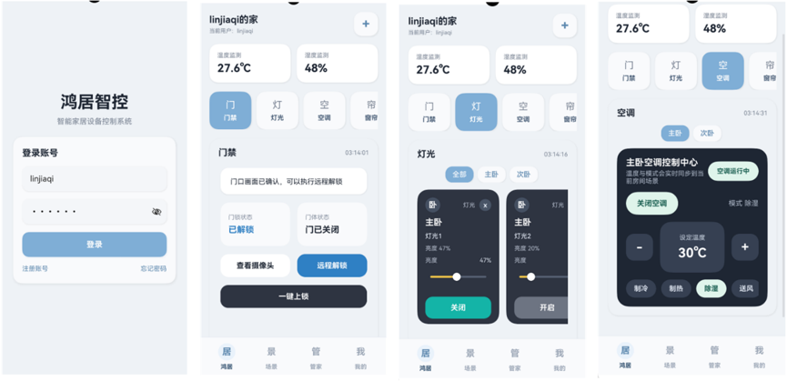
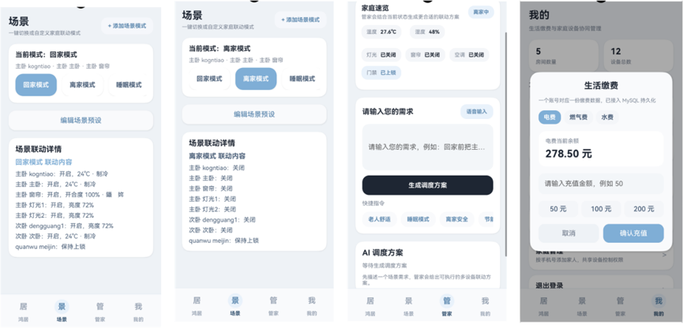
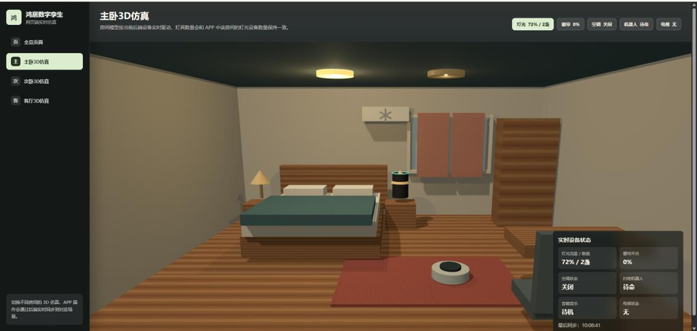

# 鸿居智控（Hongju Smart Control）

鸿居智控（Hongju Smart Control）是一款基于 OpenHarmony 的智能家居控制系统，面向家庭多设备协同控制场景设计。系统支持对灯光、空调、窗帘、门禁、环境监测及扩展设备进行统一管理，并通过 AI 管家与场景策略机制，实现从单设备控制到场景化智能调度的升级。

系统采用“移动端 App + 后端服务 + Web 数字孪生”的三层架构，支持多端状态实时同步、设备状态可视化展示和联动效果验证，形成“用户操作 -> 网关调度 -> 设备执行 -> 状态反馈”的完整闭环。

## 效果展示

### App 运行效果





### Web 数字孪生仿真效果

<!-- 请将 Web 仿真效果图放在 docs/images/web-twin-demo.png，或替换下面图片路径。 -->


## 系统组成

系统主要由三部分构成：

- 移动端 App：作为用户入口，负责设备控制、场景触发、AI 管家交互、家庭管理等功能。
- 后端服务：作为系统核心调度中心，负责设备状态管理、场景执行、AI 调度逻辑、数据存储与日志记录。
- Web 数字孪生页面：用于展示智能家居空间和设备状态，实现设备运行状态的实时反馈与联动效果验证。

## 核心功能

- 多设备统一控制：支持灯光、空调、窗帘、门禁等设备的集中管理。
- 场景联动控制：支持按家庭场景触发多设备协同执行。
- AI 管家交互：支持基于用户指令的智能控制与调度。
- 环境状态监测：支持温度、湿度等环境数据展示与状态反馈。
- 多端实时同步：App 操作、后端状态与 Web 数字孪生页面保持联动。
- 仿真可视化展示：通过 Web 页面展示设备状态变化，便于演示和验证。

## 技术架构

```text
用户
  |
  v
OpenHarmony App
  |
  v
后端服务 / 智能家居网关
  |
  +--> MySQL 数据库
  |
  +--> Web 数字孪生页面
  |
  +--> 扩展设备 / 仿真设备
```

整体数据流如下：

```text
用户操作 -> 后端调度 -> 设备状态更新 -> 数据持久化 -> App 与 Web 页面同步展示
```

## 目录结构

```text
HongjuSmartControl/
├── AppScope/                  # OpenHarmony 应用配置
├── entry/                     # OpenHarmony App 主模块
├── backend/                   # Node.js 后端服务与 Web 数字孪生页面
│   ├── server.js              # 后端入口
│   ├── public/                # Web 数字孪生静态资源
│   └── package.json           # 后端依赖配置
├── docs/                      # 文档与图片资源
├── hongju_control.sql         # MySQL 数据库初始化脚本
├── oh-package.json5           # OpenHarmony 工程依赖配置
└── build-profile.json5        # 工程构建配置
```

## 环境准备

运行系统前需要准备以下环境：

- Node.js 16 及以上版本
- DevEco Studio OpenHarmony 开发环境
- MySQL 数据库
- OpenHarmony 模拟器或真机设备

## 数据库初始化

系统使用 MySQL 数据库，数据库名称为 `hongju_control`。

```sql
CREATE DATABASE hongju_control CHARACTER SET utf8mb4 COLLATE utf8mb4_unicode_ci;
USE hongju_control;
SOURCE D:/path/to/hongju_control.sql;
```

其中 `SOURCE` 后的路径请替换为本项目中 `hongju_control.sql` 文件的实际绝对路径。

## 后端配置

在 `backend` 目录下创建或编辑 `.env` 文件，填写 MySQL 连接信息：

```env
MYSQL_DATABASE=hongju_control
MYSQL_HOST=localhost
MYSQL_PORT=3306
MYSQL_USER=用户名
MYSQL_PASSWORD=MySQL密码
```

如需修改后端端口，可增加：

```env
PORT=3027
```

## 系统启动

### 1. 启动后端服务

进入后端目录并启动服务：

```powershell
cd backend
node server.js
```

后端默认端口为 `3027`。启动成功后，可通过浏览器访问：

```text
http://127.0.0.1:3027/bedroom?username=linjiaqi
```

### 2. 启动 OpenHarmony App

使用 DevEco Studio 打开项目，选择 `entry` 模块，点击 `Run` 将应用运行到模拟器或真机。

App 默认连接地址为：

```text
http://127.0.0.1:3027
```

### 3. 查看 Web 数字孪生页面

浏览器访问：

```text
http://127.0.0.1:3027/bedroom?username=linjiaqi
```

该页面用于展示虚拟卧室中的设备状态变化，并验证 App 控制后的联动效果。

## 脱机部署与运行

在脱机测试环境中，可直接启动本地后端服务并安装现成的 HAP 包运行。

1. 启动本地后端服务：

```powershell
cd backend
node server.js
```

服务启动后将在 `3027` 端口监听，并自动连接本地 MySQL 数据库。

2. 确认 OpenHarmony 模拟器已启动。

3. 进入 SDK 的 `toolchains` 目录，确认设备连接：

```powershell
hdc list targets
```

4. 安装 HAP 包：

```powershell
hdc install "绝对路径\entry-default-unsigned.hap"
```

终端返回 `Success` 后，即可在模拟器桌面点击“鸿居智控”图标进入系统体验。

## 硬件扩展说明

当前系统为仿真架构，同时预留真实硬件扩展能力，可接入 ESP32 设备、OpenHarmony 开发板、Zigbee 网关、WiFi 智能设备等。

扩展结构如下：

```text
App -> 网关 -> 通信协议（MQTT / HTTP）-> 物理设备
```

通过扩展通信协议与设备适配层，可将当前仿真设备替换为真实智能家居设备，实现从软件仿真到实际硬件控制的迁移。

## 项目总结

鸿居智控实现了基于 OpenHarmony 的智能家居统一控制方案，具备多设备协同控制、AI 智能调度、场景联动控制及数字孪生展示能力。系统整体形成了从移动端交互、后端调度、数据库持久化到 Web 可视化反馈的完整智能家居控制闭环，适用于智能家居教学、竞赛展示与原型验证场景。
